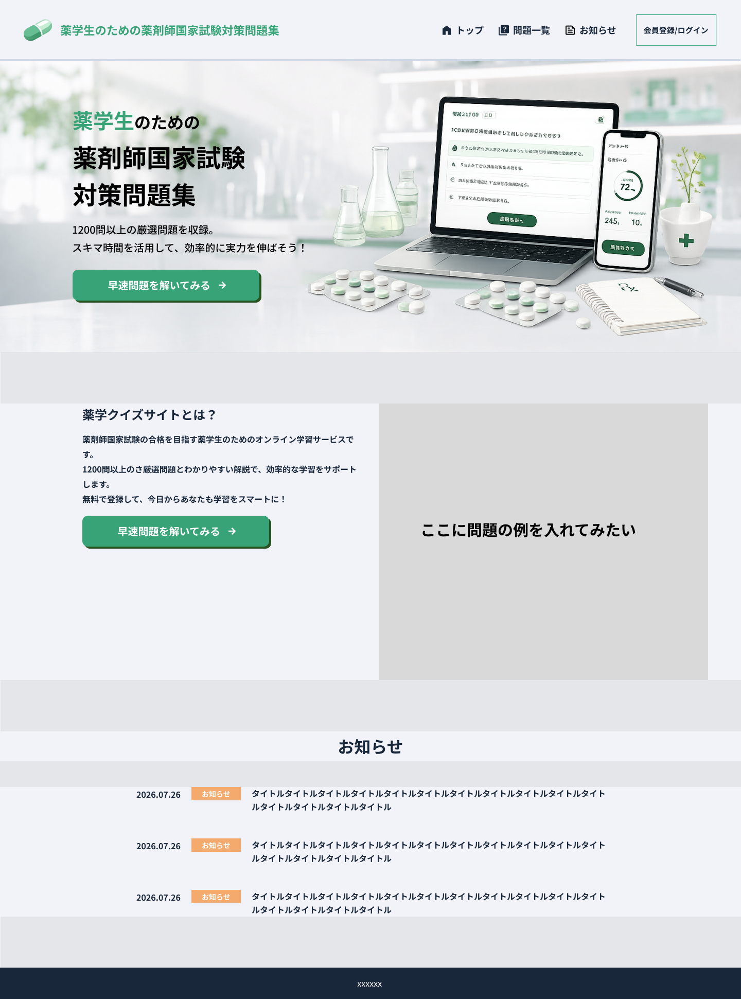
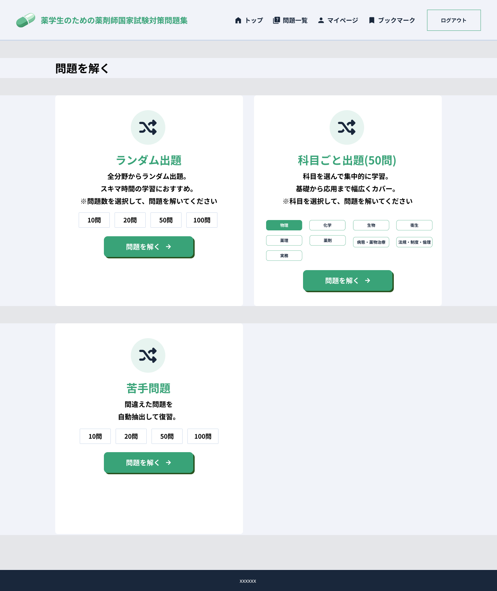
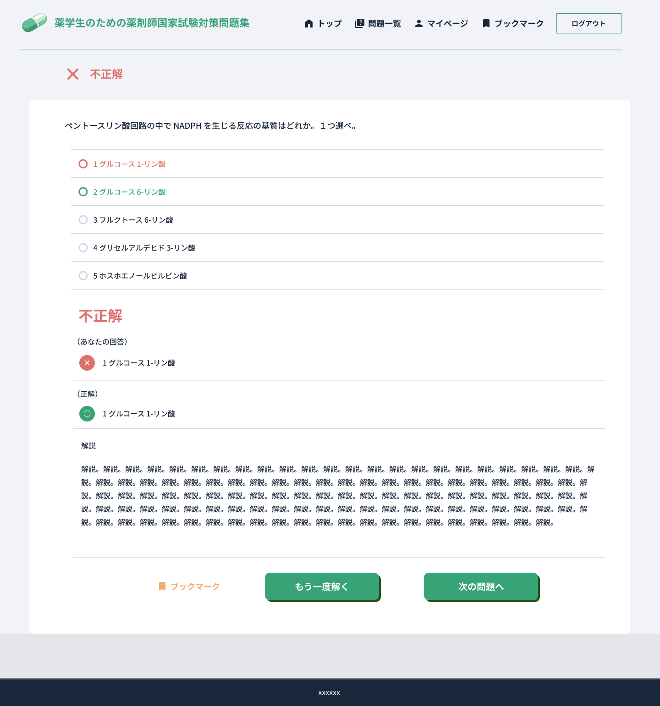
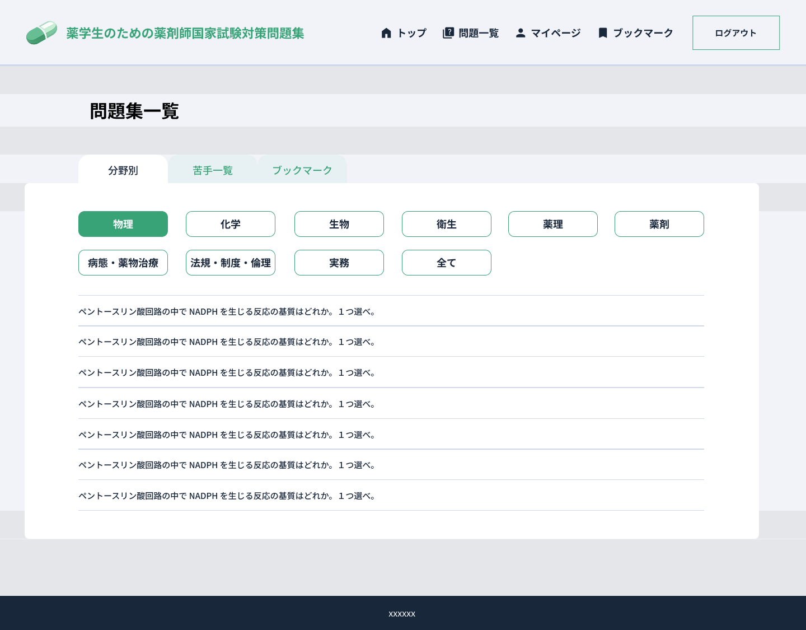
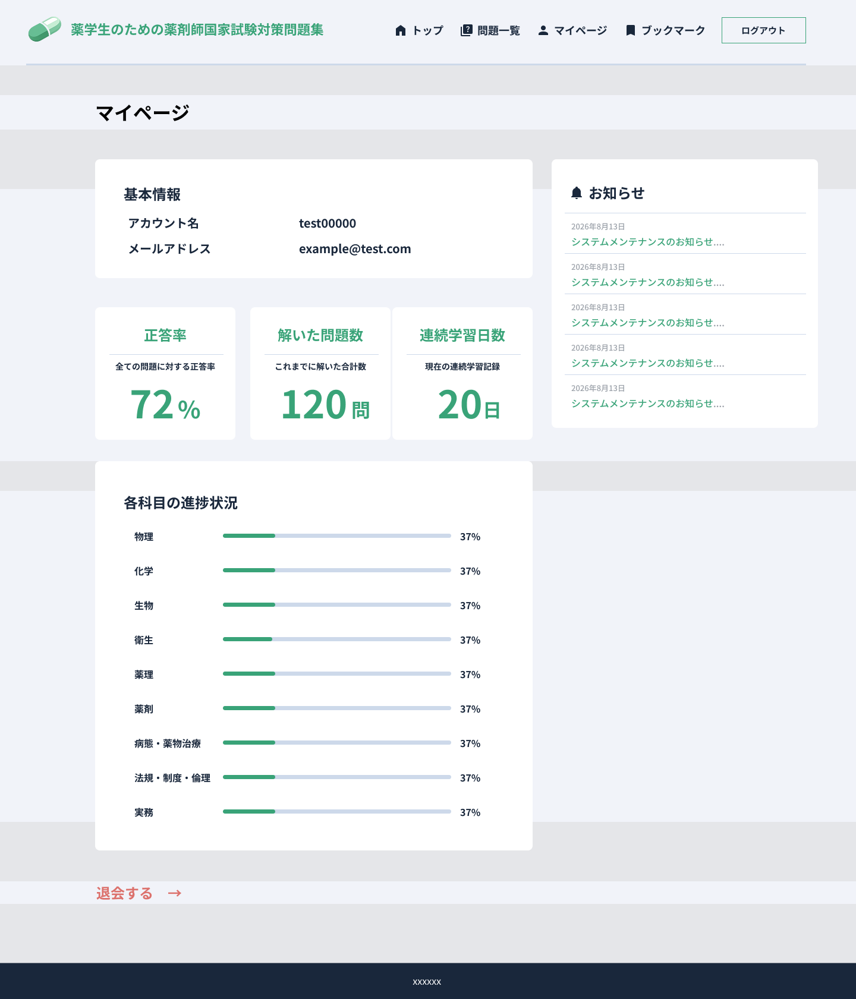
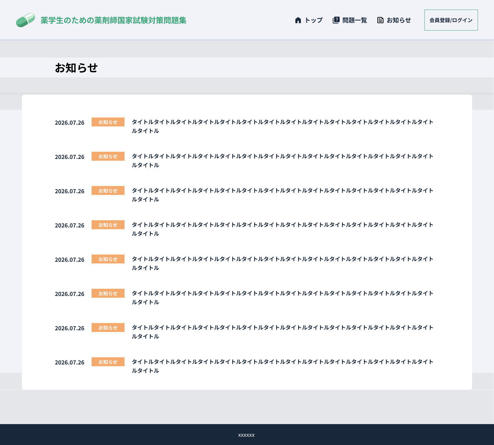

# yakugaku-quiz

薬剤師国家試験対策向けの Django 製クイズアプリです。  
ユーザー登録・ログイン後に、分野別/苦手問題モードで演習できます。

## 主な機能

- ユーザー登録、ログイン、ログアウト
- 4択クイズ（必須問題: 単一選択 / 一般問題: 複数選択）
- 回答履歴の保存
- 正答率の表示
- 苦手問題モード（同一問題で一定回数以上回答し、正答率が低い問題を抽出）
- 管理画面から問題/回答データを管理

## 技術スタック

- Python 3.12
- Django
- PostgreSQL 15
- Docker / Docker Compose

## ディレクトリ構成（抜粋）

```text
.
├── config/         # Django設定
├── accounts/       # 認証周り + トップ/マイページビュー
├── quiz/           # 問題/回答モデル、クイズロジック
├── templates/      # HTMLテンプレート
├── terraform/      # AWSインフラ定義 (IaC)
├── Dockerfile
├── docker-compose.yml
├── requirements.txt
└── manage.py
```

## セットアップ（Docker）

1. イメージをビルド

```bash
docker compose build
```

2. コンテナを起動

```bash
docker compose up -d
```

3. マイグレーションを実行

```bash
docker compose exec web python manage.py migrate
```

4. 管理ユーザーを作成（任意）

```bash
docker compose exec web python manage.py createsuperuser
```

5. ブラウザで確認

- アプリ: http://localhost:8000/
- 管理画面: http://localhost:8000/admin/

## 初期データ登録

問題データは管理画面から登録できます。

1. 管理画面にログイン
2. Question で問題文・選択肢・正解・解説・分野・問題種別を入力

### `correct` フィールド入力ルール

- 必須問題（単一選択）: `1` 〜 `4`
- 一般問題（複数選択）: `13` のように正解番号を連結

## 動作確認の流れ

1. 新規登録: `/accounts/signup/`
2. ログイン: `/accounts/login/`
3. クイズ実施: `/quiz/`
4. マイページ確認: `/mypage/`

## テスト

```bash
docker compose exec web python manage.py test
```

## 画面イメージ

### 1. トップ画面

- サービス概要の紹介、問題演習への導線、最新のお知らせプレビューを表示。

### 2. 問題・モード選択画面

- 「ランダム出題」「科目ごと出題」「苦手問題復習」から演習モードを選択。
- 10問 / 20問 / 50問 / 100問などの問題数指定や科目ごとの選択が可能。

### 3. クイズ出題・回答画面

- 進捗状況を示すプログレスバー、科目バッジ、問題文・選択肢を表示。
- 回答機能に加え、スキップ機能やブックマーク機能に対応。

### 4. 問題集一覧画面

- 「分野別」「苦手一覧」「ブックマーク」のタブ切り替えや科目別フィルターで問題を一覧検索・閲覧。

### 5. マイページ

- 正答率、解いた問題数、連続学習日数などの学習統計を表示。
- 各科目の進捗バーやユーザー基本情報、お知らせを確認可能。

### 6. お知らせ一覧画面

- システムメンテナンスやアップデートなどの告知一覧を表示。

## 補足

- 開発用設定のため `DEBUG=True` です。
- メール送信はコンソールバックエンドを使用しているため、パスワードリセットメールはコンテナログに出力されます。
- Render無料枠での一時公開は[デプロイ手順](docs/deploy/render.md)を参照してください。Renderでは `DEBUG=False` です。

## お知らせの投稿

1. `python manage.py migrate` を実行（Dockerでは `docker compose exec web python manage.py migrate`）。
2. 管理画面 `/admin/` の「お知らせ」から記事を追加。
3. タイトル・本文・公開日時を入力し、「公開する」をチェックして保存。

チェックを外すと下書き、未来の公開日時を指定すると予約公開になります。
本文はプレーンテキストです。公開済みの記事は `/news/`、トップ、マイページに表示されます。
